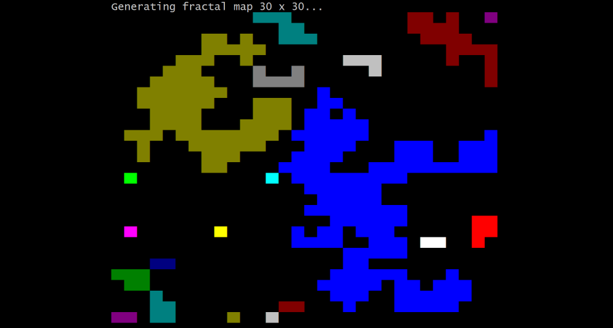
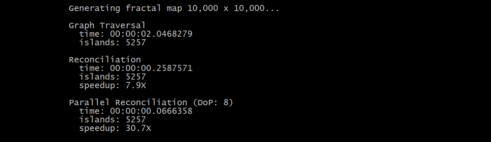

## PROBLEM

Given a 2-dimensional matrix (a map) with 0s and 1s, count the number of 'islands' on the map, where an island is a group of '1' cells connected horizontally and vertically.

## OPTIMAL PARALLEL SOLUTION

A typical graph traversal solution (flood fill) yields a poor performance as it accesses the memory randomly, what results in CPU cache misses. This algorithm (presented in the code) traverses the matrix only once, and looks to adjacent cells to the left and the top only. It discovers partial sections of islands, and then reconciles pieces together.

Such approach itself is about 8 times faster (with current implementation) due to the predictable serial access to RAM. In addition, the algorithm has a core advantage to run in parallel, what yields outperforming results on large datasets as shown below.

There is much more room for improvement though if it's re-written in C++ and the `Dictionary<int,int>` is replaced with a problem-specific data structure.